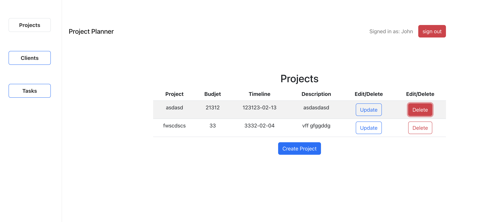
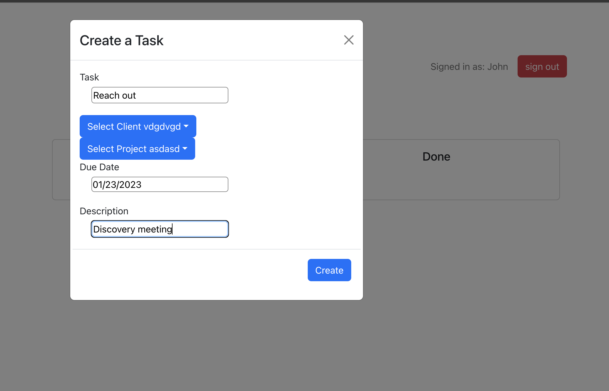
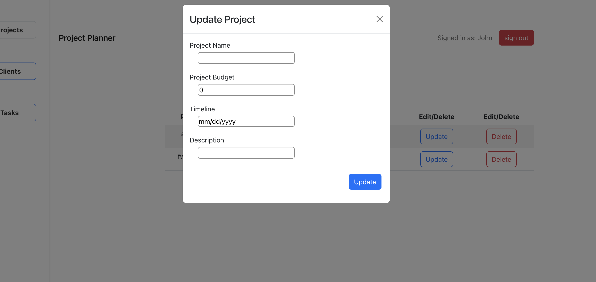

# Project Planner

Project Planner is a front-end application built with React, utilizing hooks like `useEffect`, Redux, and `useState`. It is built using the Vite build tool and provides a solution for managing clients, projects, and tickets in a simplified manner. The goal of this project is to address the need for a project management tool that is less complicated than platforms like SalesForce, while still offering essential features for daily work requirements.

## Features

- **Client Management**: Add, update, and delete client information.

- **Project Management**: Create, modify, and remove project details.
- **Ticket Management**: Track and manage tickets associated with projects.

- **React Components**: Utilize reusable React components for efficient development.
- **Hooks**: Utilize hooks like `useEffect`, Redux, and `useState` for state management and component lifecycle control.
- **User-Friendly Interface**: Provide an intuitive and user-friendly interface for seamless navigation and interaction.
- **Simplified Project Management**: Offer a streamlined project management experience without unnecessary complexity.

## Installation

1. Clone the repository: `git clone https://github.com/your-username/project-name.git`
2. Navigate to the project directory: `cd project-planner-client`
3. Install dependencies: `npm install`
4. Start the development server: `npm run dev`
5. Open the application in your browser: `http://localhost:5173/`

## Usage

1. Sign in or create a new account.

2. Navigate through the dashboard to access client, project, and ticket management.
3. Use the provided forms and controls to add, update, or delete client, project, and ticket information.

4. Explore the user-friendly interface and take advantage of the simplified project management features.
5. Feel free to customize the application according to your specific requirements.

## Contributing

Contributions are welcome! If you have any suggestions, improvements, or bug fixes, please submit a pull request. For major changes, please open an issue first to discuss the proposed changes.

## Contact

For any inquiries or feedback, please reach out to [Malek Alarmash](mailto:malek.alarmash@gmail.com).

